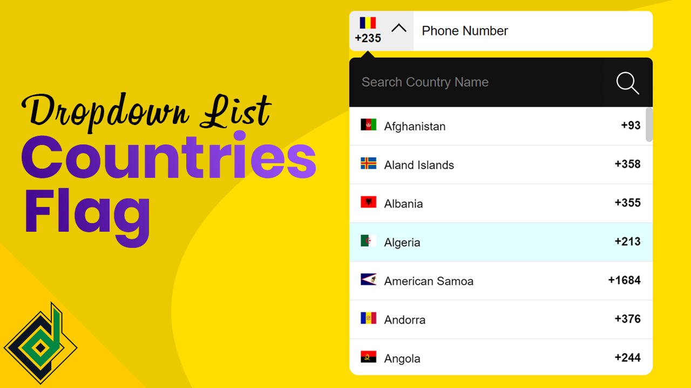

#Telephone Input Field With Country Code & Flag | Custom Dropdown List
>By: Coding Design

Phone numbers are standardized in an international format known as **E.164** which combines country codes and subscriber numbers in a format like this: __+14155552671__. This format is required by **many APIs (including Twilio's)** and means that you don't have to store country codes and phone numbers in two separate database columns.

However, you probably don't want your users to have to type in a + sign and country code when they provide their phone number.

This video will walk through how to build a phone number input field with country code and flag using HTML,CSS & vanilla JavaScript.

>You can do whatever you want with the code.     
However, if you love my content, you can **SUBSCRIBE** my YouTube Channel

🌎link: www.youtube.com/codingdesign